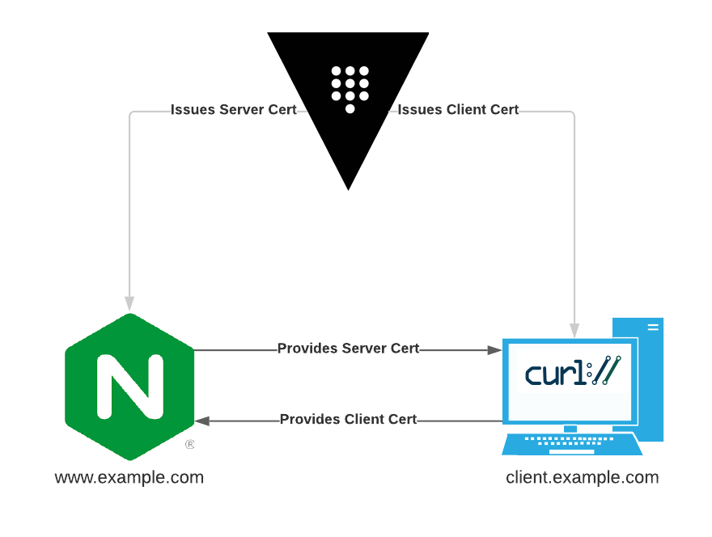

# Overview

This README and repository contains the instructions and materials necessary to replicate the demo from my RocDev Talk: "Build a PKI for your Apps in 5 Minutes with Hashicorp Vault"

# Disclaimer

This is designed to be a demo for **development purposes**. Literally nothing here is designed for production use. In fact, several actions in this demo (such as using only 1 unseal key for Vault) would be very, very bad in production.

If you intend to use Vault as a production PKI, ensure that you know what you're doing.

# Topology



This demo will deploy the following:
* Vault, running in server mode on the local machine
* NGINX, running in a container

NGINX will be configured to:
* Enable TLS using a certificate created with the deployed Vault CA
* Require clients to present a certificate signed by the Vault CA

For the sake of demonstration, cURL will be used as the client in this topology. You can use your imagination and pretend this is a real app.

# Prerequisites

To follow along, you will need:

* A Linux computer (this is untested with Mac or Windows)
* Docker
* cURL
* Editor of your preference

# Instructions

First, clone this repo:

```
git clone git@github.com:acritelli/five-minute-pki.git
```

Download latest [Vault binary](https://www.vaultproject.io/downloads), unzip it, and move it to a location in your `$PATH`:

```
wget https://releases.hashicorp.com/vault/1.7.1/vault_1.7.1_linux_amd64.zip
unzip vault_1.7.1_linux_amd64.zip
mv vault /usr/local/bin/
```

Start up a Vault server using the provided config. This will launch Vault using persistent, file-based storage in `data/` so that you can stop and restart Vault, if needed.

```
vault server -config=config/
```


With Vault running in server mode, launch another terminal to perform additional commands from. Set your `VAULT_ADDR` environment variable:

```
export VAULT_ADDR='http://127.0.0.1:8200'
```

Initialize Vault. Note that this only needs to be done **once.** You don't have to repeat this if you stop and restart Vault. The `tee` command saves the unseal key and root token into a file for later retrieval.

```
$ vault operator init -key-shares=1 -key-threshold=1 | tee init.txt
Unseal Key 1: HkWQna4pR8M7eW649Dijii/RazPOj4n+PItjOWq9yaY=

Initial Root Token: s.YwDWkPH8qaRNuzkjIFPuAWww

Vault initialized with 1 key shares and a key threshold of 1. Please securely
distribute the key shares printed above. When the Vault is re-sealed,
restarted, or stopped, you must supply at least 1 of these keys to unseal it
before it can start servicing requests.

Vault does not store the generated master key. Without at least 1 key to
reconstruct the master key, Vault will remain permanently sealed!

It is possible to generate new unseal keys, provided you have a quorum of
existing unseal keys shares. See "vault operator rekey" for more information.

```

Unseal Vault. This must be done every time Vault is restarted. Use the unseal key from the `init` action above.

```
$ vault operator unseal
Unseal Key (will be hidden): 
Key             Value
---             -----
Seal Type       shamir
Initialized     true
Sealed          false
Total Shares    1
Threshold       1
Version         1.7.1
Storage Type    file
Cluster Name    vault-cluster-3bf17c1a
Cluster ID      ef51a85e-1291-aa09-d580-4bf5f49f3f16
HA Enabled      false
```

Log into Vault using the root token from the `init` action above:

```
$ vault login
Token (will be hidden): 
Success! You are now authenticated. The token information displayed below
is already stored in the token helper. You do NOT need to run "vault login"
again. Future Vault requests will automatically use this token.

Key                  Value
---                  -----
token                s.YwDWkPH8qaRNuzkjIFPuAWww
token_accessor       8SbuIyJeq1lfW9RbmIG8ScWc
token_duration       ∞
token_renewable      false
token_policies       ["root"]
identity_policies    []
policies             ["root"]

```

Enable the PKI secrets engine and adjust the maximum lease TTL to 1 year:

```
$ vault secrets enable pki
Success! Enabled the pki secrets engine at: pki/

$ vault secrets tune -max-lease-ttl=8760h pki
Success! Tuned the secrets engine at: pki/
```

Tell Vault to generate a root CA certificate:

```
$ vault write pki/root/generate/internal \
common_name=example.com \
ttl=8760h
Key              Value
---              -----
certificate      <-- output snipped -->
expiration       1652540586
issuing_ca       <-- output snipped -->
serial_number    42:6c:e5:1e:0b:5d:2a:bb:92:96:07:84:2b:22:28:45:9b:e8:d6:99

```

Create a new role that will allow you to sign certificates for example.com and its subdomains:

```
$ vault write pki/roles/example.com \
allowed_domains=example.com \
allow_subdomains=true
Success! Data written to: pki/roles/example.com
```

Generate a certificate for the web server at www.example.com:

```
❯ vault write pki/issue/example.com common_name=www.example.com
Key                 Value
---                 -----
certificate         <-- output snipped -->
expiration          1623769552
issuing_ca          <-- output snipped -->
private_key         <-- output snipped -->
private_key_type    rsa
serial_number       7b:5a:4a:d0:f7:4f:af:48:62:17:8f:a7:0b:01:d0:d7:4c:91:2c:73
```

Copy the following values from the above output to the specified files:

|    Value    |             File              |                                  Description                                  |
| ----------- | ----------------------------- | ----------------------------------------------------------------------------- |
| certificate | nginx/tls/www.example.com.crt | The certificate for www.example.com                                           |
| issuing_ca  | nginx/tls/example.com.ca.crt  | The CA certificate for the Vault CA. Used for client certificate verification |
| private_key | nginx/tls/www.example.com.key | The private key for the www.example.com certificate                           |

Open yet another terminal and launch an NGINX container. Be sure to update the bind mounts below to point at the appropriate directories on your system:

```
docker run --rm \
-v /home/tony/Desktop/five_minute_pki/nginx/html:/usr/share/nginx/html \
-v /home/tony/Desktop/five_minute_pki/nginx/conf.d/:/etc/nginx/conf.d \
-v /home/tony/Desktop/five_minute_pki/nginx/tls:/etc/nginx/tls \
-p 8443:443 \
nginx
```

Edit your `/etc/hosts` file and add a line like the one below:
```
127.0.0.1 www.example.com
```

Attempt to access the website running in the container. It should fail at this point because you have not supplied a client certificate:

```
$ curl -k https://www.example.com:8443
<html>
<head><title>400 No required SSL certificate was sent</title></head>
<body>
<center><h1>400 Bad Request</h1></center>
<center>No required SSL certificate was sent</center>
<hr><center>nginx/1.19.10</center>
</body>
</html>
```

Generate a client certificate:
```
$ vault write pki/issue/example.com common_name=client.example.com

Key                 Value
---                 -----
certificate         <-- output snipped -->
expiration          1623769850
issuing_ca          <-- output snipped -->
private_key         <-- output snipped -->
private_key_type    rsa
serial_number       7d:53:76:52:91:85:05:9c:cd:9a:15:c9:a9:fc:ea:af:de:38:ae:fd
```

Save the `certificate` and `private_key` values, concatenated together, into a file called `client.example.com.pem`.

Attempt to access the website again, but this time specify the client certificate:
```
$ curl -k -E client.example.com.pem https://www.example.com:8443
<h1>Hello!</h1>
```

# Additional Resources

If you ever intend to try using Vault as a production PKI, be sure to check out some of the resources below.

* [Overview of the PKI Secrets Engine](https://www.vaultproject.io/docs/secrets/pki)
* [Build your own CA tutorial](https://learn.hashicorp.com/tutorials/vault/pki-engine)
* [PKI API Docs](https://www.vaultproject.io/api/secret/pki)
